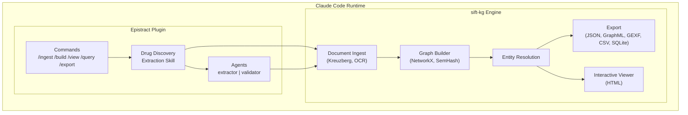

# Epistract Phase 1 Implementation Plan

> **For agentic workers:** REQUIRED: Use superpowers:subagent-driven-development (if subagents available) or superpowers:executing-plans to implement this plan. Steps use checkbox (`- [ ]`) syntax for tracking.

**Goal:** Build a working Claude Code plugin that ingests drug discovery documents, extracts entities/relations using Claude + the drug discovery domain schema, validates molecular identifiers, builds a knowledge graph via sift-kg, and opens an interactive visualization.

**Architecture:** Epistract is a Claude Code plugin at `~/code/epistract/` (symlinked to `~/.claude/plugins/epistract`). Claude reads documents and produces extraction JSON matching sift-kg's `DocumentExtraction` format. sift-kg handles graph building, dedup, community detection, export, and visualization. Molecular validation scripts (RDKit/Biopython) run inline via Bash.

**Tech Stack:** Python 3.11+, sift-kg (engine), RDKit (optional, SMILES), Biopython (optional, sequences), Claude Code (runtime), `beautiful-mermaid` (diagrams)

---

## File Structure

```
epistract/
├── .claude-plugin/
│   └── plugin.json                              # [exists] Plugin manifest
├── commands/
│   ├── setup.md                                 # /epistract-setup
│   ├── ingest.md                                # /epistract-ingest (main pipeline)
│   ├── build.md                                 # /epistract-build
│   ├── validate.md                              # /epistract-validate
│   ├── view.md                                  # /epistract-view
│   ├── query.md                                 # /epistract-query
│   └── export.md                                # /epistract-export
├── skills/
│   └── drug-discovery-extraction/
│       ├── SKILL.md                             # Core extraction skill (domain schema + prompts)
│       ├── references/
│       │   ├── entity-types.md                  # Quick reference card
│       │   └── relation-types.md                # Quick reference card
│       └── validation-scripts/
│           ├── scan_patterns.py                 # Regex scanner for molecular identifiers
│           ├── validate_smiles.py               # RDKit SMILES validation
│           └── validate_sequences.py            # Biopython sequence validation
├── agents/
│   ├── extractor.md                             # Parallel per-document extraction
│   └── validator.md                             # Molecular validation agent
├── scripts/
│   ├── setup.sh                                 # Dependency installation
│   ├── build_extraction.py                      # Write extraction JSON in sift-kg format
│   ├── validate_molecules.py                    # Orchestrate molecular validation
│   └── run_sift.py                              # sift-kg Python API wrapper
├── docs/
│   ├── drug-discovery-domain-spec.md            # [exists] Full schema spec
│   ├── epistract-plugin-design.md               # [exists] Architecture design
│   ├── plans/
│   │   ├── 2026-03-16-epistract-TODO.md         # [exists] TODO tracker
│   │   └── 2026-03-16-phase1-implementation.md  # [this file]
│   └── diagrams/                                # Mermaid source + rendered SVGs
│       ├── architecture.mmd
│       ├── data-flow.mmd
│       └── molecular-biology-chain.mmd
├── README.md                                    # [exists] Scientist-facing
├── DEVELOPER.md                                 # [exists] Technical reference
├── LICENSE                                      # [exists] MIT
└── .gitignore                                   # [exists]
```

---

## Chunk 1: Domain YAML + Setup Command

### Task 1: Create the drug-discovery domain YAML

The domain YAML is the foundation — sift-kg's graph builder uses it to enforce entity/relation type constraints, canonical names, and direction rules. We start with the Phase 1 core types (not all 23 — the full set would overwhelm the LLM prompt). We use the 13 most critical types for drug discovery extraction via sift-kg's native LLM pipeline, with the full 23 types reserved for Claude-as-extractor in the skill.

**Files:**
- Create: `skills/drug-discovery-extraction/domain.yaml`

- [ ] **Step 1: Write the drug-discovery domain YAML**

This is the sift-kg-compatible domain file with entity types, relation types, system_context, extraction hints, and source/target constraints. We include the 13 core types that work well with any LLM (sift-kg's native extraction path), plus key relation types.

```yaml
name: "Drug Discovery"
version: "1.0.0"
description: |
  Expert domain for pharmaceutical and biotech drug discovery.
  Grounded in Biolink Model, ChEBI, HGNC, MeSH, MedDRA, and 40+
  biomedical ontologies. Extracts compounds, targets, mechanisms,
  trials, biomarkers, pathways, and their relationships.

system_context: |
  You are analyzing drug discovery and pharmaceutical research documents
  to build a scientifically rigorous knowledge graph.

  NOMENCLATURE STANDARDS:
  - Drugs: Use INN (International Nonproprietary Name). Record brand
    names and development codes as attributes.
  - Genes: Use HGNC symbols (EGFR, TP53, BRCA1). Mutations use
    protein-level notation (V600E, G12C).
  - Proteins: Use standard UniProt names. Distinguish from genes.
  - Diseases: Use MeSH-preferred terms. Include molecular subtypes.
  - Adverse events: Use MedDRA preferred terms. Include CTCAE grades.

  DISAMBIGUATION:
  - GENE vs PROTEIN: "EGFR mutation" → GENE; "EGFR receptor" → PROTEIN
  - COMPOUND vs MECHANISM_OF_ACTION: "pembrolizumab" → COMPOUND;
    "PD-1 checkpoint blockade" → MECHANISM_OF_ACTION
  - ADVERSE_EVENT vs DISEASE: "hepatotoxicity from drug X" → ADVERSE_EVENT;
    "hepatitis B" → DISEASE

  CONFIDENCE:
  - 0.9-1.0: Explicitly stated, primary finding, strong evidence
  - 0.7-0.9: Clearly supported but secondary
  - 0.5-0.7: Reasonable inference, indirect evidence
  - <0.5: Speculative — flag for review

fallback_relation: ASSOCIATED_WITH

entity_types:
  COMPOUND:
    description: "Drug molecules, candidates, biologics, vaccines, gene therapies"
    extraction_hints:
      - "INN names, brand names, development codes (AZD9291, BMS-986016)"
      - "Includes small molecules AND biologics (antibodies, ADCs, CAR-T, mRNA)"
      - "For combinations (nivolumab + ipilimumab), extract each as separate entity"

  GENE:
    description: "Genes, genetic loci, fusions, mutations — the unit of heredity"
    extraction_hints:
      - "Use HGNC symbols: EGFR, TP53, BRCA1, ALK"
      - "Mutations: BRAF V600E, KRAS G12C, EGFR T790M"
      - "Fusions: EML4-ALK, BCR-ABL, NTRK fusion"
      - "Use GENE for genomic/mutation context, PROTEIN for signaling/binding"

  PROTEIN:
    description: "Proteins, receptors, enzymes, ion channels, transporters"
    extraction_hints:
      - "Receptors (PD-1, HER2, VEGFR), enzymes (CDK4/6, PI3Ka, mTOR)"
      - "Use PROTEIN for drug binding, protein function context"
      - "Distinguish from GENE: p53 protein → PROTEIN; TP53 mutation → GENE"

  DISEASE:
    description: "Diseases, conditions, indications with molecular subtypes"
    extraction_hints:
      - "Use precise terms: 'non-small cell lung cancer' not 'lung cancer'"
      - "Include subtypes: HER2+ breast cancer, EGFR-mutant NSCLC"
      - "Use MeSH-preferred terms when possible"

  MECHANISM_OF_ACTION:
    description: "Pharmacological mechanisms — how drugs work"
    extraction_hints:
      - "Terms like inhibitor, agonist, antagonist, blocker, degrader, checkpoint blockade"
      - "Be specific: 'selective CDK4/6 inhibition' not just 'inhibition'"
      - "This is the HOW; the target is the WHAT"

  CLINICAL_TRIAL:
    description: "Clinical studies with identifiers"
    extraction_hints:
      - "Trial names: KEYNOTE-024, DESTINY-Breast03, CheckMate-067"
      - "NCT numbers (NCTxxxxxxxx pattern)"
      - "Capture phase, design, primary endpoint, key results"

  PATHWAY:
    description: "Signaling pathways, metabolic pathways, biological processes"
    extraction_hints:
      - "Named pathways: MAPK/ERK, PI3K/AKT/mTOR, Wnt/beta-catenin"
      - "Cellular processes: apoptosis, autophagy, DNA damage repair"
      - "Immune pathways: PD-1/PD-L1 axis, cGAS-STING"

  BIOMARKER:
    description: "Measurable indicators for diagnosis/treatment selection"
    extraction_hints:
      - "PD-L1 (TPS, CPS), TMB, MSI-H/dMMR, HRD"
      - "Capture biomarker class (predictive/prognostic) when stated"
      - "Note thresholds: TPS >= 50%, TMB >= 10 mut/Mb"

  ADVERSE_EVENT:
    description: "Drug side effects, toxicities, safety signals"
    extraction_hints:
      - "Use MedDRA preferred terms when recognizable"
      - "Capture CTCAE grades and frequencies"
      - "Note immune-related adverse events (irAEs) specifically"

  ORGANIZATION:
    description: "Pharma companies, biotech, regulatory agencies, academic institutions"
    extraction_hints:
      - "Use widely recognized names: Roche not F. Hoffmann-La Roche AG"
      - "Regulatory agencies: FDA, EMA, PMDA, NMPA"

  PUBLICATION:
    description: "Papers, patents, regulatory documents discussed substantively"
    extraction_hints:
      - "Extract publications discussed substantively, not just cited"
      - "Capture PMID, DOI, journal, year when mentioned"

  REGULATORY_ACTION:
    description: "FDA approvals, EMA authorizations, breakthrough designations"
    extraction_hints:
      - "Be specific: 'FDA accelerated approval' not just 'approval'"
      - "Capture date, agency, indication"

  PHENOTYPE:
    description: "Observable biological characteristics, tumor features, resistance phenotypes"
    extraction_hints:
      - "Tumor phenotypes: microsatellite instability, HRD, TILs"
      - "Resistance phenotypes: acquired resistance via specific mutations"
      - "Distinguish from DISEASE (diagnosed condition) and BIOMARKER (used for Dx/Rx)"

relation_types:
  TARGETS:
    description: "Compound acts on a molecular target"
    source_types: [COMPOUND]
    target_types: [PROTEIN, GENE]
  INHIBITS:
    description: "Inhibits a target, pathway, or process"
    source_types: [COMPOUND, PROTEIN]
    target_types: [PROTEIN, GENE, PATHWAY]
  ACTIVATES:
    description: "Activates a target, pathway, or process"
    source_types: [COMPOUND, PROTEIN]
    target_types: [PROTEIN, GENE, PATHWAY]
  BINDS_TO:
    description: "Physical binding interaction"
    source_types: [COMPOUND, PROTEIN]
    target_types: [PROTEIN]
    symmetric: true
  HAS_MECHANISM:
    description: "Compound operates through a mechanism of action"
    source_types: [COMPOUND]
    target_types: [MECHANISM_OF_ACTION]
  INDICATED_FOR:
    description: "Compound indicated/studied/approved for a disease"
    source_types: [COMPOUND]
    target_types: [DISEASE]
  CONTRAINDICATED_FOR:
    description: "Compound contraindicated for a condition"
    source_types: [COMPOUND]
    target_types: [DISEASE]
    review_required: true
  EVALUATED_IN:
    description: "Compound evaluated in a clinical trial"
    source_types: [COMPOUND]
    target_types: [CLINICAL_TRIAL]
  CAUSES:
    description: "Compound causes an adverse event"
    source_types: [COMPOUND]
    target_types: [ADVERSE_EVENT]
  DERIVED_FROM:
    description: "Compound derived from or successor to another"
    source_types: [COMPOUND]
    target_types: [COMPOUND]
  COMBINED_WITH:
    description: "Compounds used in combination therapy"
    source_types: [COMPOUND]
    target_types: [COMPOUND]
    symmetric: true
  ENCODES:
    description: "Gene encodes a protein"
    source_types: [GENE]
    target_types: [PROTEIN]
  PARTICIPATES_IN:
    description: "Protein/gene participates in a pathway"
    source_types: [PROTEIN, GENE]
    target_types: [PATHWAY]
  IMPLICATED_IN:
    description: "Gene/protein/pathway implicated in disease"
    source_types: [GENE, PROTEIN, PATHWAY, PHENOTYPE]
    target_types: [DISEASE]
  CONFERS_RESISTANCE_TO:
    description: "Mutation/mechanism confers drug resistance"
    source_types: [GENE, PROTEIN, PHENOTYPE]
    target_types: [COMPOUND]
    review_required: true
  PREDICTS_RESPONSE_TO:
    description: "Biomarker predicts response to therapy"
    source_types: [BIOMARKER]
    target_types: [COMPOUND, MECHANISM_OF_ACTION]
    review_required: true
  DIAGNOSTIC_FOR:
    description: "Biomarker diagnostic/prognostic for disease"
    source_types: [BIOMARKER]
    target_types: [DISEASE]
    review_required: true
  DEVELOPED_BY:
    description: "Compound/trial developed by organization"
    source_types: [COMPOUND, CLINICAL_TRIAL]
    target_types: [ORGANIZATION]
  PUBLISHED_IN:
    description: "Trial/compound findings published in publication"
    source_types: [CLINICAL_TRIAL, COMPOUND]
    target_types: [PUBLICATION]
  GRANTS_APPROVAL_FOR:
    description: "Regulatory action grants approval for compound"
    source_types: [REGULATORY_ACTION]
    target_types: [COMPOUND]
  EXPRESSED_IN:
    description: "Gene/protein expressed in cell type or tissue"
    source_types: [GENE, PROTEIN]
    target_types: [PHENOTYPE]
  ASSOCIATED_WITH:
    description: "General association — use only when no specific type fits"
    symmetric: true
```

- [ ] **Step 2: Verify domain loads in sift-kg**

Run:
```bash
.venv/bin/python -c "
from sift_kg.domains.loader import DomainLoader
loader = DomainLoader()
d = loader.load_from_path('skills/drug-discovery-extraction/domain.yaml')
print(f'Loaded: {d.name} — {len(d.entity_types)} entity types, {len(d.relation_types)} relation types')
for name in d.entity_types: print(f'  Entity: {name}')
for name in d.relation_types: print(f'  Relation: {name}')
"
```

Expected: Loads cleanly with 13 entity types, 22 relation types.

- [ ] **Step 3: Commit**

```bash
git add skills/drug-discovery-extraction/domain.yaml
git commit -m "feat: add drug-discovery domain YAML (13 entity types, 22 relations)"
```

### Task 2: Create /epistract-setup command

**Files:**
- Create: `commands/setup.md`
- Create: `scripts/setup.sh`

- [ ] **Step 1: Write setup.sh**

```bash
#!/bin/bash
set -e

echo "=== Epistract Setup ==="
echo ""

# Check Python
python3 -c "import sys; v=sys.version_info; assert v >= (3, 11), f'Python 3.11+ required, got {v.major}.{v.minor}'" 2>/dev/null || {
  echo "ERROR: Python 3.11+ is required."
  exit 1
}
echo "✓ Python $(python3 --version | cut -d' ' -f2)"

# Check/install sift-kg
python3 -c "import sift_kg" 2>/dev/null || {
  echo "Installing sift-kg..."
  uv pip install sift-kg 2>/dev/null || pip install sift-kg
}
echo "✓ sift-kg $(python3 -c 'from sift_kg import __version__; print(__version__)')"

# Optional: RDKit
python3 -c "from rdkit import Chem" 2>/dev/null && {
  echo "✓ RDKit (molecular validation available)"
} || {
  echo "○ RDKit not installed (SMILES validation unavailable)"
  echo "  Install with: uv pip install rdkit-pypi"
}

# Optional: Biopython
python3 -c "from Bio import Seq" 2>/dev/null && {
  echo "✓ Biopython (sequence validation available)"
} || {
  echo "○ Biopython not installed (sequence validation unavailable)"
  echo "  Install with: uv pip install biopython"
}

echo ""
echo "Setup complete. Use /epistract-ingest <path> to get started."
```

- [ ] **Step 2: Write setup command markdown**

```markdown
---
name: epistract-setup
description: Install epistract dependencies (sift-kg, optional RDKit/Biopython)
---

Run the setup script to install and verify all dependencies.

Run this command:
```bash
bash ${CLAUDE_PLUGIN_ROOT}/scripts/setup.sh
```

If sift-kg is not installed, install it:
```bash
uv pip install sift-kg
```

For molecular validation (optional but recommended):
```bash
uv pip install rdkit-pypi biopython
```

Report the status of each dependency to the user.
```

- [ ] **Step 3: Make setup.sh executable and commit**

```bash
chmod +x scripts/setup.sh
git add commands/setup.md scripts/setup.sh
git commit -m "feat: add /epistract-setup command"
```

---

## Chunk 2: Core Extraction Skill + Extraction Adapter

### Task 3: Create the drug-discovery-extraction SKILL.md

This is the brain of the system. It teaches Claude how to extract biomedical entities and relations from scientific text. The skill loads into context when the plugin is active.

**Files:**
- Create: `skills/drug-discovery-extraction/SKILL.md`

- [ ] **Step 1: Write SKILL.md**

The skill file contains:
1. When to activate (drug discovery documents, pharma papers, biomedical text)
2. The entity type schema (13 types with extraction guidance)
3. The relation type schema (22 types with source/target constraints)
4. The extraction output format (sift-kg DocumentExtraction JSON)
5. Disambiguation rules
6. Confidence calibration
7. Molecular identifier detection guidance

The full SKILL.md will be ~600 lines. Key sections:

```markdown
---
name: drug-discovery-extraction
description: >
  Use when extracting entities and relations from drug discovery,
  pharmaceutical, or biomedical documents. Activates for PubMed papers,
  bioRxiv preprints, clinical trial reports, FDA documents, patent
  filings, and any document discussing compounds, targets, mechanisms,
  diseases, or clinical trials.
version: 1.0.0
---

# Drug Discovery Knowledge Graph Extraction

You are an expert biomedical knowledge engineer extracting structured
entities and relations from scientific literature for a drug discovery
knowledge graph.

## Output Format

For each text chunk, output ONLY valid JSON:

{
  "entities": [
    {
      "name": "entity name (use standard nomenclature)",
      "entity_type": "TYPE_NAME",
      "attributes": {"key": "value"},
      "confidence": 0.0-1.0,
      "context": "exact quote from source text"
    }
  ],
  "relations": [
    {
      "relation_type": "TYPE_NAME",
      "source_entity": "source entity name",
      "target_entity": "target entity name",
      "confidence": 0.0-1.0,
      "evidence": "exact quote from source text"
    }
  ]
}

## Entity Types

[Full 13-type schema with descriptions and extraction hints — pulled from domain.yaml]

## Relation Types

[Full 22-type schema with source/target constraints]

## Naming Conventions
[INN, HGNC, MeSH, MedDRA, HGVS standards]

## Disambiguation Rules
[Gene vs Protein, Compound vs MOA, Disease vs Phenotype, AE vs Disease]

## Confidence Calibration
[0.9-1.0: explicit, 0.7-0.9: supported, 0.5-0.7: inferred, <0.5: speculative]

## Molecular Identifier Detection

When you encounter SMILES strings, InChI, nucleotide sequences, amino acid
sequences, CAS numbers, or patent numbers in the text:
- Quote the EXACT surrounding text containing the identifier
- Do NOT attempt to reproduce the identifier yourself
- Flag the entity with attribute: {"requires_validation": true}
- Note the identifier type in attributes: {"notation_type": "SMILES"}

## Document Type Strategies

### Research Articles (PubMed/bioRxiv)
Extract findings with statistical evidence. Note in vitro vs in vivo vs human.

### Clinical Trial Reports
Extract trial design, endpoints, results. Capture HR, ORR, p-values.

### Patent Documents
Extract from Examples sections (specific compounds with activity data).
Markush claims define compound families, not individual compounds.
Prophetic examples get confidence 0.4-0.6.

### Review Articles
Extract consensus knowledge. Note conflicting evidence.
```

- [ ] **Step 2: Commit**

```bash
git add skills/drug-discovery-extraction/SKILL.md
git commit -m "feat: add drug-discovery-extraction skill (core extraction knowledge)"
```

### Task 4: Create extraction adapter scripts

**Files:**
- Create: `scripts/build_extraction.py`
- Create: `scripts/run_sift.py`

- [ ] **Step 1: Write build_extraction.py**

This script writes Claude's extraction output into sift-kg's `DocumentExtraction` JSON format.

```python
#!/usr/bin/env python3
"""Write Claude's extraction output to sift-kg DocumentExtraction format.

Usage:
    python build_extraction.py <doc_id> <output_dir> < extraction.json
    python build_extraction.py <doc_id> <output_dir> --json '{"entities": [...], "relations": [...]}'
"""

import json
import sys
from datetime import datetime, timezone
from pathlib import Path


def write_extraction(
    doc_id: str,
    output_dir: str,
    entities: list[dict],
    relations: list[dict],
    document_path: str = "",
    chunks_processed: int = 1,
    chunk_size: int = 10000,
) -> str:
    """Write a single document's extraction in sift-kg format."""
    extraction = {
        "document_id": doc_id,
        "document_path": document_path,
        "chunks_processed": chunks_processed,
        "entities": entities,
        "relations": relations,
        "cost_usd": 0.0,
        "model_used": "claude-code",
        "domain_name": "Drug Discovery",
        "chunk_size": chunk_size,
        "extracted_at": datetime.now(timezone.utc).isoformat(),
        "error": None,
    }

    out_path = Path(output_dir) / "extractions" / f"{doc_id}.json"
    out_path.parent.mkdir(parents=True, exist_ok=True)
    out_path.write_text(json.dumps(extraction, indent=2))
    return str(out_path)


if __name__ == "__main__":
    if len(sys.argv) < 3:
        print("Usage: python build_extraction.py <doc_id> <output_dir> [--json '<json>']")
        sys.exit(1)

    doc_id = sys.argv[1]
    output_dir = sys.argv[2]

    if "--json" in sys.argv:
        idx = sys.argv.index("--json")
        data = json.loads(sys.argv[idx + 1])
    else:
        data = json.load(sys.stdin)

    path = write_extraction(
        doc_id=doc_id,
        output_dir=output_dir,
        entities=data.get("entities", []),
        relations=data.get("relations", []),
        document_path=data.get("document_path", ""),
        chunks_processed=data.get("chunks_processed", 1),
    )
    print(f"Written: {path}")
```

- [ ] **Step 2: Write run_sift.py**

```python
#!/usr/bin/env python3
"""sift-kg Python API wrapper for epistract plugin.

Usage:
    python run_sift.py build <output_dir> [--domain <path>]
    python run_sift.py view <output_dir> [--neighborhood <entity>] [--top <n>]
    python run_sift.py export <output_dir> <format>
    python run_sift.py info <output_dir>
    python run_sift.py search <output_dir> <query>
"""

import json
import sys
from pathlib import Path


def cmd_build(output_dir: str, domain_path: str | None = None):
    from sift_kg import run_build, load_domain

    domain = (
        load_domain(domain_path=Path(domain_path))
        if domain_path
        else load_domain(domain_path=Path(__file__).parent.parent / "skills" / "drug-discovery-extraction" / "domain.yaml")
    )
    kg = run_build(Path(output_dir), domain)
    print(json.dumps({
        "entities": kg.entity_count,
        "relations": kg.relation_count,
        "graph_path": str(Path(output_dir) / "graph_data.json"),
    }))


def cmd_view(output_dir: str, **kwargs):
    from sift_kg import run_view
    run_view(Path(output_dir), **{k: v for k, v in kwargs.items() if v is not None})


def cmd_export(output_dir: str, fmt: str):
    from sift_kg import run_export
    path = run_export(Path(output_dir), fmt)
    print(f"Exported: {path}")


def cmd_info(output_dir: str):
    from sift_kg import KnowledgeGraph
    graph_path = Path(output_dir) / "graph_data.json"
    if not graph_path.exists():
        print(json.dumps({"error": "No graph found"}))
        return
    kg = KnowledgeGraph.load(graph_path)
    data = kg.export()
    print(json.dumps(data["metadata"], indent=2))


def cmd_search(output_dir: str, query: str):
    from sift_kg import KnowledgeGraph
    graph_path = Path(output_dir) / "graph_data.json"
    kg = KnowledgeGraph.load(graph_path)
    query_lower = query.lower()
    results = []
    for node_id, data in kg.graph.nodes(data=True):
        name = data.get("name", "")
        if query_lower in name.lower() or query_lower in node_id.lower():
            results.append({"id": node_id, "name": name, "type": data.get("entity_type", ""), "confidence": data.get("confidence", 0)})
    print(json.dumps(results, indent=2))


if __name__ == "__main__":
    if len(sys.argv) < 3:
        print(__doc__)
        sys.exit(1)

    cmd = sys.argv[1]
    if cmd == "build":
        domain = None
        if "--domain" in sys.argv:
            domain = sys.argv[sys.argv.index("--domain") + 1]
        cmd_build(sys.argv[2], domain)
    elif cmd == "view":
        kwargs = {}
        if "--neighborhood" in sys.argv:
            kwargs["neighborhood"] = sys.argv[sys.argv.index("--neighborhood") + 1]
        if "--top" in sys.argv:
            kwargs["top_n"] = int(sys.argv[sys.argv.index("--top") + 1])
        cmd_view(sys.argv[2], **kwargs)
    elif cmd == "export":
        cmd_export(sys.argv[2], sys.argv[3])
    elif cmd == "info":
        cmd_info(sys.argv[2])
    elif cmd == "search":
        cmd_search(sys.argv[2], " ".join(sys.argv[3:]))
    else:
        print(f"Unknown command: {cmd}")
        sys.exit(1)
```

- [ ] **Step 3: Commit**

```bash
git add scripts/build_extraction.py scripts/run_sift.py
git commit -m "feat: add extraction adapter and sift-kg API wrapper scripts"
```

---

## Chunk 3: Molecular Validation Scripts

### Task 5: Create pattern scanner

**Files:**
- Create: `skills/drug-discovery-extraction/validation-scripts/scan_patterns.py`

- [ ] **Step 1: Write scan_patterns.py**

```python
#!/usr/bin/env python3
"""Scan text for molecular identifiers using regex patterns.

Usage:
    python scan_patterns.py <text_file>
    python scan_patterns.py --extraction <extraction_json>
"""

import json
import re
import sys
from pathlib import Path

PATTERNS = {
    "smiles": {
        "pattern": r'(?<![A-Za-z])([A-IK-Z][a-z]?(?:[\(\)\[\]=#@+\-\\\/\.:0-9]|[A-IK-Z][a-z]?){5,})(?![A-Za-z])',
        "entity_type": "CHEMICAL_STRUCTURE",
    },
    "inchi": {
        "pattern": r'(InChI=1S?/[A-Za-z0-9\.\+\-\(\)/,;?]+)',
        "entity_type": "CHEMICAL_STRUCTURE",
    },
    "inchikey": {
        "pattern": r'([A-Z]{14}-[A-Z]{10}-[A-Z])',
        "entity_type": "CHEMICAL_STRUCTURE",
    },
    "cas_number": {
        "pattern": r'\b(\d{2,7}-\d{2}-\d)\b',
        "entity_type": "CHEMICAL_STRUCTURE",
    },
    "dna_sequence": {
        "pattern": r'(?<![A-Z])([ATGC]{15,})(?![A-Z])',
        "entity_type": "NUCLEOTIDE_SEQUENCE",
    },
    "rna_sequence": {
        "pattern": r'(?<![A-Z])([AUGC]{15,})(?![A-Z])',
        "entity_type": "NUCLEOTIDE_SEQUENCE",
    },
    "amino_acid_1letter": {
        "pattern": r'(?<![A-Z])([ARNDCEQGHILKMFPSTWYV]{10,})(?![A-Z])',
        "entity_type": "PEPTIDE_SEQUENCE",
    },
    "nct_number": {
        "pattern": r'(NCT\d{8})',
        "entity_type": "CLINICAL_TRIAL",
    },
    "us_patent": {
        "pattern": r'(US\s*\d{1,3},?\d{3},?\d{3}\s*[AB]\d?)',
        "entity_type": "PUBLICATION",
    },
    "pct_patent": {
        "pattern": r'(WO\s*\d{4}/\d{5,6})',
        "entity_type": "PUBLICATION",
    },
}


def scan_text(text: str) -> list[dict]:
    """Find all molecular identifier patterns in text."""
    matches = []
    for name, config in PATTERNS.items():
        for m in re.finditer(config["pattern"], text):
            matches.append({
                "pattern_type": name,
                "value": m.group(1) if m.lastindex else m.group(0),
                "start": m.start(),
                "end": m.end(),
                "entity_type": config["entity_type"],
                "context": text[max(0, m.start() - 50):m.end() + 50],
            })
    return matches


if __name__ == "__main__":
    if len(sys.argv) < 2:
        print("Usage: python scan_patterns.py <text_file>")
        sys.exit(1)

    if sys.argv[1] == "--extraction":
        data = json.loads(Path(sys.argv[2]).read_text())
        # Scan context and evidence fields in extraction
        all_text = ""
        for e in data.get("entities", []):
            all_text += " " + e.get("context", "")
        for r in data.get("relations", []):
            all_text += " " + r.get("evidence", "")
        matches = scan_text(all_text)
    else:
        text = Path(sys.argv[1]).read_text()
        matches = scan_text(text)

    print(json.dumps(matches, indent=2))
    print(f"\nFound {len(matches)} molecular identifiers", file=sys.stderr)
```

- [ ] **Step 2: Commit**

```bash
git add skills/drug-discovery-extraction/validation-scripts/scan_patterns.py
git commit -m "feat: add regex pattern scanner for molecular identifiers"
```

### Task 6: Create SMILES validator

**Files:**
- Create: `skills/drug-discovery-extraction/validation-scripts/validate_smiles.py`

- [ ] **Step 1: Write validate_smiles.py**

```python
#!/usr/bin/env python3
"""Validate SMILES strings using RDKit.

Usage:
    python validate_smiles.py <smiles_string>
    python validate_smiles.py --batch < smiles_list.json
"""

import json
import sys


def validate_smiles(smiles: str) -> dict:
    """Validate a SMILES string. Returns properties if valid."""
    try:
        from rdkit import Chem
        from rdkit.Chem import Descriptors, inchi, rdMolDescriptors
    except ImportError:
        return {"valid": None, "error": "RDKit not installed. Run: uv pip install rdkit-pypi"}

    mol = Chem.MolFromSmiles(smiles)
    if mol is None:
        return {"valid": False, "input": smiles, "error": "Invalid SMILES"}

    canonical = Chem.MolToSmiles(mol)
    mol_inchi = inchi.MolToInchi(mol)
    mol_inchikey = inchi.MolToInchiKey(mol) if mol_inchi else None

    return {
        "valid": True,
        "input": smiles,
        "canonical_smiles": canonical,
        "inchi": mol_inchi,
        "inchikey": mol_inchikey,
        "molecular_formula": rdMolDescriptors.CalcMolFormula(mol),
        "molecular_weight": round(Descriptors.ExactMolWt(mol), 2),
        "logp": round(Descriptors.MolLogP(mol), 2),
        "hbd": Descriptors.NumHDonors(mol),
        "hba": Descriptors.NumHAcceptors(mol),
        "tpsa": round(Descriptors.TPSA(mol), 1),
        "num_rings": rdMolDescriptors.CalcNumRings(mol),
        "num_rotatable_bonds": Descriptors.NumRotatableBonds(mol),
        "lipinski_violations": sum([
            Descriptors.ExactMolWt(mol) > 500,
            Descriptors.MolLogP(mol) > 5,
            Descriptors.NumHDonors(mol) > 5,
            Descriptors.NumHAcceptors(mol) > 10,
        ]),
    }


if __name__ == "__main__":
    if len(sys.argv) < 2 or sys.argv[1] == "--batch":
        # Batch mode: read JSON array from stdin
        data = json.load(sys.stdin)
        results = [validate_smiles(s) for s in data]
        print(json.dumps(results, indent=2))
    else:
        result = validate_smiles(sys.argv[1])
        print(json.dumps(result, indent=2))
```

- [ ] **Step 2: Commit**

```bash
git add skills/drug-discovery-extraction/validation-scripts/validate_smiles.py
git commit -m "feat: add RDKit SMILES validator"
```

### Task 7: Create sequence validator

**Files:**
- Create: `skills/drug-discovery-extraction/validation-scripts/validate_sequences.py`

- [ ] **Step 1: Write validate_sequences.py**

```python
#!/usr/bin/env python3
"""Validate nucleotide and amino acid sequences using Biopython.

Usage:
    python validate_sequences.py <sequence>
    python validate_sequences.py --type DNA <sequence>
    python validate_sequences.py --batch < sequences.json
"""

import json
import sys


def detect_type(seq: str) -> str:
    """Auto-detect sequence type."""
    s = seq.upper().replace(" ", "").replace("-", "").replace("\n", "")
    if not s:
        return "unknown"
    chars = set(s)
    if chars <= set("ATGCNRYWSMKHBVD"):
        return "DNA"
    if chars <= set("AUGCNRYWSMKHBVD"):
        return "RNA"
    if chars <= set("ACDEFGHIKLMNPQRSTVWYX*"):
        return "protein"
    return "unknown"


def validate_sequence(seq: str, seq_type: str | None = None) -> dict:
    """Validate a sequence. Returns properties if valid."""
    try:
        from Bio.Seq import Seq
        from Bio.SeqUtils import gc_fraction
    except ImportError:
        return {"valid": None, "error": "Biopython not installed. Run: uv pip install biopython"}

    clean = seq.upper().replace(" ", "").replace("-", "").replace("\n", "")
    if not clean:
        return {"valid": False, "error": "Empty sequence"}

    detected = seq_type or detect_type(clean)

    if detected == "DNA":
        valid_chars = set("ATGCNRYWSMKHBVD")
        invalid = set(clean) - valid_chars
        if invalid:
            return {"valid": False, "type": "DNA", "error": f"Invalid DNA characters: {invalid}"}
        bio_seq = Seq(clean)
        result = {
            "valid": True,
            "type": "DNA",
            "length": len(clean),
            "gc_content": round(gc_fraction(bio_seq), 3),
            "complement": str(bio_seq.complement()),
            "reverse_complement": str(bio_seq.reverse_complement()),
        }
        if len(clean) % 3 == 0 and len(clean) >= 9:
            result["translation"] = str(bio_seq.translate())
        return result

    elif detected == "RNA":
        valid_chars = set("AUGCNRYWSMKHBVD")
        invalid = set(clean) - valid_chars
        if invalid:
            return {"valid": False, "type": "RNA", "error": f"Invalid RNA characters: {invalid}"}
        return {"valid": True, "type": "RNA", "length": len(clean)}

    elif detected == "protein":
        valid_chars = set("ACDEFGHIKLMNPQRSTVWYX*")
        invalid = set(clean) - valid_chars
        if invalid:
            return {"valid": False, "type": "protein", "error": f"Invalid amino acids: {invalid}"}
        try:
            from Bio.SeqUtils.ProtParam import ProteinAnalysis
            analysis_seq = clean.replace("*", "").replace("X", "A")
            if len(analysis_seq) < 2:
                return {"valid": True, "type": "protein", "length": len(clean)}
            analysis = ProteinAnalysis(analysis_seq)
            return {
                "valid": True,
                "type": "protein",
                "length": len(clean),
                "molecular_weight": round(analysis.molecular_weight(), 1),
                "isoelectric_point": round(analysis.isoelectric_point(), 2),
                "aromaticity": round(analysis.aromaticity(), 3),
                "instability_index": round(analysis.instability_index(), 1),
                "gravy": round(analysis.gravy(), 3),
            }
        except Exception as e:
            return {"valid": True, "type": "protein", "length": len(clean), "analysis_error": str(e)}

    return {"valid": False, "error": f"Unknown sequence type for: {clean[:20]}..."}


if __name__ == "__main__":
    if len(sys.argv) < 2 or sys.argv[1] == "--batch":
        data = json.load(sys.stdin)
        results = [validate_sequence(s.get("sequence", s) if isinstance(s, dict) else s,
                                     s.get("type") if isinstance(s, dict) else None)
                   for s in data]
        print(json.dumps(results, indent=2))
    else:
        seq_type = None
        seq = sys.argv[-1]
        if "--type" in sys.argv:
            seq_type = sys.argv[sys.argv.index("--type") + 1]
        result = validate_sequence(seq, seq_type)
        print(json.dumps(result, indent=2))
```

- [ ] **Step 2: Commit**

```bash
git add skills/drug-discovery-extraction/validation-scripts/validate_sequences.py
git commit -m "feat: add Biopython sequence validator"
```

### Task 8: Create validation orchestrator

**Files:**
- Create: `scripts/validate_molecules.py`

- [ ] **Step 1: Write validate_molecules.py**

Scans extraction JSONs, runs validators, updates extractions with validated attributes.

```python
#!/usr/bin/env python3
"""Orchestrate molecular validation across all extraction JSONs.

Usage:
    python validate_molecules.py <output_dir>
"""

import json
import sys
from pathlib import Path

# Import sibling scripts
SCRIPT_DIR = Path(__file__).parent.parent / "skills" / "drug-discovery-extraction" / "validation-scripts"
sys.path.insert(0, str(SCRIPT_DIR))

from scan_patterns import scan_text


def run_validation(output_dir: str) -> dict:
    """Scan all extraction JSONs and validate molecular identifiers."""
    extractions_dir = Path(output_dir) / "extractions"
    if not extractions_dir.exists():
        return {"error": "No extractions directory found"}

    stats = {"files_scanned": 0, "smiles_found": 0, "smiles_valid": 0,
             "sequences_found": 0, "sequences_valid": 0, "identifiers_found": 0}

    # Try importing validators
    has_rdkit = False
    has_biopython = False
    try:
        from validate_smiles import validate_smiles
        has_rdkit = True
    except ImportError:
        pass
    try:
        from validate_sequences import validate_sequence
        has_biopython = True
    except ImportError:
        pass

    for path in sorted(extractions_dir.glob("*.json")):
        data = json.loads(path.read_text())
        stats["files_scanned"] += 1

        # Scan all text fields for patterns
        all_text = ""
        for e in data.get("entities", []):
            all_text += " " + e.get("context", "")
        for r in data.get("relations", []):
            all_text += " " + r.get("evidence", "")

        matches = scan_text(all_text)
        stats["identifiers_found"] += len(matches)

        for match in matches:
            if match["pattern_type"] == "smiles" and has_rdkit:
                stats["smiles_found"] += 1
                result = validate_smiles(match["value"])
                if result.get("valid"):
                    stats["smiles_valid"] += 1
                    match["validation"] = result

            elif match["pattern_type"] in ("dna_sequence", "rna_sequence", "amino_acid_1letter") and has_biopython:
                stats["sequences_found"] += 1
                result = validate_sequence(match["value"])
                if result.get("valid"):
                    stats["sequences_valid"] += 1
                    match["validation"] = result

    # Save validation results
    validation_dir = Path(output_dir) / "validation"
    validation_dir.mkdir(exist_ok=True)
    (validation_dir / "results.json").write_text(json.dumps({
        "stats": stats,
        "has_rdkit": has_rdkit,
        "has_biopython": has_biopython,
    }, indent=2))

    return stats


if __name__ == "__main__":
    if len(sys.argv) < 2:
        print("Usage: python validate_molecules.py <output_dir>")
        sys.exit(1)

    stats = run_validation(sys.argv[1])
    print(json.dumps(stats, indent=2))
```

- [ ] **Step 2: Commit**

```bash
git add scripts/validate_molecules.py
git commit -m "feat: add molecular validation orchestrator"
```

---

## Chunk 4: Commands + Agents

### Task 9: Create /epistract-ingest command

The main command — orchestrates the full pipeline.

**Files:**
- Create: `commands/ingest.md`

- [ ] **Step 1: Write ingest.md**

```markdown
---
name: epistract-ingest
description: Ingest documents and build a drug discovery knowledge graph
---

You are running the epistract ingestion pipeline. Follow these steps precisely.

**Arguments:** The user provides a path to a directory or file containing documents.

## Step 1: Read Documents

Use sift-kg's document reader to read and chunk all documents:

```bash
python3 ${CLAUDE_PLUGIN_ROOT}/scripts/run_sift.py read <path> --output <output_dir>
```

Or if the path is a directory, discover and read documents manually:
- List all files in the directory
- For each supported file (PDF, DOCX, TXT, HTML, etc.), read the content using sift-kg's ingest module
- Chunk text into ~10,000 character segments

## Step 2: Extract Entities and Relations

For each document chunk, use your drug-discovery-extraction skill knowledge to extract entities and relations.

**For each chunk**, read the text and output JSON matching this format:
```json
{
  "entities": [{"name": "...", "entity_type": "...", "attributes": {}, "confidence": 0.0-1.0, "context": "..."}],
  "relations": [{"relation_type": "...", "source_entity": "...", "target_entity": "...", "confidence": 0.0-1.0, "evidence": "..."}]
}
```

Write each document's extraction using:
```bash
python3 ${CLAUDE_PLUGIN_ROOT}/scripts/build_extraction.py <doc_id> <output_dir> --json '<json>'
```

**For multiple documents (>3):** Dispatch extraction agents in parallel using the Agent tool with subagent_type "general-purpose". Each agent processes one document.

## Step 3: Validate Molecular Identifiers

```bash
python3 ${CLAUDE_PLUGIN_ROOT}/scripts/validate_molecules.py <output_dir>
```

## Step 4: Build Knowledge Graph

```bash
python3 ${CLAUDE_PLUGIN_ROOT}/scripts/run_sift.py build <output_dir> --domain ${CLAUDE_PLUGIN_ROOT}/skills/drug-discovery-extraction/domain.yaml
```

## Step 5: Open Visualization

```bash
python3 ${CLAUDE_PLUGIN_ROOT}/scripts/run_sift.py view <output_dir>
```

## Step 6: Report Summary

Report to the user:
- Number of documents processed
- Entity counts by type
- Relation counts by type
- Molecular identifiers validated
- Link to the interactive viewer
```

- [ ] **Step 2: Commit**

```bash
git add commands/ingest.md
git commit -m "feat: add /epistract-ingest command (main pipeline)"
```

### Task 10: Create remaining commands

**Files:**
- Create: `commands/build.md`
- Create: `commands/validate.md`
- Create: `commands/view.md`
- Create: `commands/query.md`
- Create: `commands/export.md`

- [ ] **Step 1: Write all 5 command files**

Each is a short markdown file invoking the appropriate `run_sift.py` subcommand or validation script. (These are straightforward wrappers — code provided in implementation.)

- [ ] **Step 2: Commit**

```bash
git add commands/
git commit -m "feat: add build, validate, view, query, export commands"
```

### Task 11: Create agents

**Files:**
- Create: `agents/extractor.md`
- Create: `agents/validator.md`

- [ ] **Step 1: Write extractor.md**

```markdown
---
description: Extract biomedical entities and relations from a single document for the epistract drug discovery knowledge graph. Use when /epistract-ingest needs to process multiple documents in parallel.
---

You are an extraction agent for the epistract drug discovery knowledge graph.

You will be given:
1. A document path to read
2. An output directory for the extraction JSON
3. The drug discovery domain schema

Read the document text. For each chunk (~10,000 characters), extract entities and relations following the drug discovery domain schema.

Entity types: COMPOUND, GENE, PROTEIN, DISEASE, MECHANISM_OF_ACTION, CLINICAL_TRIAL, PATHWAY, BIOMARKER, ADVERSE_EVENT, ORGANIZATION, PUBLICATION, REGULATORY_ACTION, PHENOTYPE

Use standard nomenclature: INN for drugs, HGNC for genes, MeSH for diseases, MedDRA for adverse events.

Write the extraction JSON using:
```bash
python3 ${CLAUDE_PLUGIN_ROOT}/scripts/build_extraction.py <doc_id> <output_dir> --json '<json>'
```
```

- [ ] **Step 2: Write validator.md**

```markdown
---
description: Validate molecular identifiers (SMILES, sequences, CAS numbers) found in epistract extraction results. Use when /epistract-ingest or /epistract-validate needs molecular validation.
---

You are a molecular validation agent for epistract.

Run the validation pipeline:
```bash
python3 ${CLAUDE_PLUGIN_ROOT}/scripts/validate_molecules.py <output_dir>
```

Report the results: how many SMILES validated, sequences validated, identifiers found.

If RDKit or Biopython are not installed, inform the user and suggest installation commands.
```

- [ ] **Step 3: Commit**

```bash
git add agents/
git commit -m "feat: add extractor and validator agents"
```

---

## Chunk 5: Reference Cards + Entity/Relation Quick Reference

### Task 12: Create reference cards

**Files:**
- Create: `skills/drug-discovery-extraction/references/entity-types.md`
- Create: `skills/drug-discovery-extraction/references/relation-types.md`

- [ ] **Step 1: Write entity-types.md** — concise reference card of all 13 entity types with naming conventions and disambiguation rules.

- [ ] **Step 2: Write relation-types.md** — concise reference card of all 22 relation types with source/target constraints and extraction guidance.

- [ ] **Step 3: Commit**

```bash
git add skills/drug-discovery-extraction/references/
git commit -m "feat: add entity and relation type quick reference cards"
```

---

## Chunk 6: Diagrams (Mermaid)

### Task 13: Convert ASCII diagrams to Mermaid

**Files:**
- Create: `docs/diagrams/architecture.mmd`
- Create: `docs/diagrams/data-flow.mmd`
- Create: `docs/diagrams/molecular-biology-chain.mmd`
- Update: `README.md` — replace ASCII diagrams with rendered Mermaid
- Update: `DEVELOPER.md` — replace ASCII diagrams with rendered Mermaid

- [ ] **Step 1: Write architecture.mmd**



- [ ] **Step 2: Write data-flow.mmd and molecular-biology-chain.mmd**

- [ ] **Step 3: Render with beautiful-mermaid**

```bash
bunx beautiful-mermaid docs/diagrams/architecture.mmd --theme nord --format svg
bunx beautiful-mermaid docs/diagrams/data-flow.mmd --theme nord --format svg
bunx beautiful-mermaid docs/diagrams/molecular-biology-chain.mmd --theme nord --format svg
```

- [ ] **Step 4: Update README.md and DEVELOPER.md with rendered diagrams**

- [ ] **Step 5: Commit**

```bash
git add docs/diagrams/ README.md DEVELOPER.md
git commit -m "docs: convert ASCII diagrams to Mermaid (architecture, data flow, molecular biology)"
```

---

## Chunk 7: End-to-End Test

### Task 14: End-to-end test with real PubMed abstracts

- [ ] **Step 1: Create test documents**

Create 3-5 short text files with real PubMed abstracts about KRAS inhibitors (publicly available abstracts).

- [ ] **Step 2: Run /epistract-setup to verify environment**

- [ ] **Step 3: Run /epistract-ingest on test documents**

Verify:
- Extraction JSONs produced in output/extractions/
- Each has entities and relations
- Entity types match the schema
- Confidence scores are in range

- [ ] **Step 4: Verify graph builds**

```bash
python3 scripts/run_sift.py build ./epistract-output
python3 scripts/run_sift.py info ./epistract-output
```

Verify: entity count > 0, relation count > 0.

- [ ] **Step 5: Verify visualization works**

```bash
python3 scripts/run_sift.py view ./epistract-output
```

Verify: graph.html opens in browser, shows nodes and edges.

- [ ] **Step 6: Verify export works**

```bash
python3 scripts/run_sift.py export ./epistract-output sqlite
python3 scripts/run_sift.py export ./epistract-output csv
```

- [ ] **Step 7: Run molecular validation**

```bash
python3 scripts/validate_molecules.py ./epistract-output
```

- [ ] **Step 8: Commit test data and update TODO**

```bash
git add tests/ docs/plans/2026-03-16-epistract-TODO.md
git commit -m "test: end-to-end test with PubMed abstracts"
```

---

## Summary

| Chunk | Tasks | Key Deliverables |
|---|---|---|
| 1: Domain + Setup | 1-2 | domain.yaml, /epistract-setup |
| 2: Skill + Adapter | 3-4 | SKILL.md, build_extraction.py, run_sift.py |
| 3: Validation | 5-8 | scan_patterns.py, validate_smiles.py, validate_sequences.py, validate_molecules.py |
| 4: Commands + Agents | 9-11 | /epistract-ingest + 5 other commands, extractor + validator agents |
| 5: Reference Cards | 12 | entity-types.md, relation-types.md |
| 6: Diagrams | 13 | 3 Mermaid diagrams, README/DEVELOPER updates |
| 7: E2E Test | 14 | Working pipeline with real PubMed abstracts |

**Total: 14 tasks, ~7 commits, estimated 30-45 minutes of implementation.**
